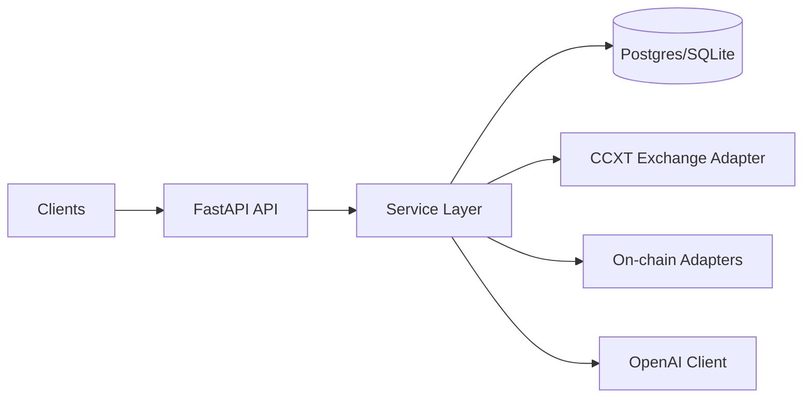

# Crypto Trading Copilot API

[](https://github.com/wari1986/crypto-copilot-api/actions/workflows/ci.yml)

Backend service for a crypto trading copilot focused on safe automation primitives: market data ingestion, DEX pool snapshots, health/readiness checks, and schema-driven execution payloads.

## Why This Project
I built this to show production-oriented backend skills in an AI-adjacent domain:
- asynchronous Python API design
- typed service/repository boundaries
- migration-driven data modeling
- explicit security hygiene (secret leak prevention + repo history cleanup)
- CI-driven quality gates

## Current Status
Implemented and runnable API scope is listed below. Some Week 1 endpoints are intentionally stubbed or parked and are tracked as future work.

## Architecture


## Quickstart (Local, uv)
```bash
cp .env.example .env
uv sync --all-extras
make migrate
make run
```

Open:
- `http://localhost:8000/`
- `http://localhost:8000/docs`
- `http://localhost:8000/api/v1/health`

## Quickstart (Docker)
```bash
cp .env.example .env
docker compose up -d --build
docker compose exec api sh -lc "uv run alembic upgrade head"
./scripts/smoke_local.sh
```

## Implemented API Endpoints
- `GET /`
- `GET /api/v1/health`
- `GET /api/v1/ready`
- `POST /api/v1/candles/backfill`
- `GET /api/v1/candles`
- `GET /api/v1/marketdata/orderbook`
- `GET /api/v1/marketdata/trades`
- `POST /api/v1/exec-sim/submit`
- `GET /api/v1/dex/uniswapv3/pools/{chain}/{pool_address}`
- `GET /api/v1/dex/meteora/pools/{chain}/{pool_address}`

## Not Yet Enabled
Routes currently present in codebase but commented out:
- instruments listing/detail
- portfolio positions/orders/pnl
- llm decide endpoint
- ticker latest endpoint

## Developer Workflow
```bash
make fmt
make lint
make test
```

Install commit hooks:
```bash
uv run pre-commit install
```

## Security
- Never commit real credentials.
- `.env*` files are blocked by pre-commit except `.env.example`.
- See `SECURITY.md` for reporting and remediation policy.

## Roadmap
1. Re-enable portfolio/instruments/llm endpoints behind feature flags.
2. Add deterministic integration test matrix (SQLite + Postgres).
3. Add policy/risk engine simulation scenarios and benchmark traces.

## License
MIT
